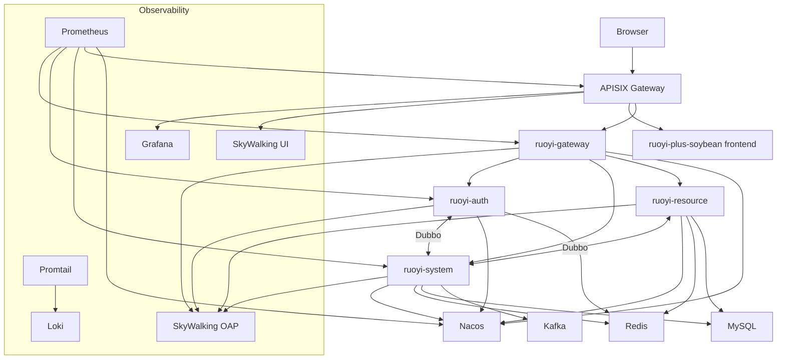

# 目标部署架构

## 总体架构

## 命名空间规划

| Namespace | 内容 |
|---|---|
| `infra` | MySQL、Redis、Kafka、Nacos |
| `apisix` | APISIX、APISIX Ingress Controller、etcd |
| `observability` | Prometheus、Grafana、Loki、Promtail、SkyWalking |
| `ruoyi` | RuoYi 后端服务和前端服务 |

## Helm 管理边界

| Chart | 管理内容 | 策略 |
|---|---|---|
| `platform-infra` | MySQL、Redis、Kafka、Nacos | 可组合第三方 chart 与项目自定义 values |
| `traffic-gateway` | APISIX、etcd、ApisixRoute | APISIX 作为唯一入口 |
| `observability` | Prometheus、Grafana、Loki、Promtail、SkyWalking | 优先用官方 chart |
| `ruoyi-backend` | Java 微服务 | 项目自定义 chart |
| `ruoyi-frontend` | 前端静态站点 | 项目自定义 chart |

## 关键设计决策

### APISIX 作为唯一入口

避免 Nginx Ingress、APISIX、Service NodePort 多入口并存导致排障困难。所有外部 HTTP 请求统一进入 APISIX。

### Loki 作为第一阶段日志方案

本机 32GB 环境下，Loki 比 ELK 更轻。日志先从 Pod stdout 采集，后续再考虑 Kafka/Logstash/Elasticsearch。

### Nacos 保留项目配置中心角色

后端服务仍通过 Nacos 获取 `application-common.yml`、`datasource.yml` 和服务专属配置。K8s ConfigMap 不替代 Nacos，只承载部署层参数。

### Helm 管理所有部署对象

手写 kubectl apply 仅用于临时调试，不作为最终交付路径。最终以 `helm upgrade --install` 管理。
