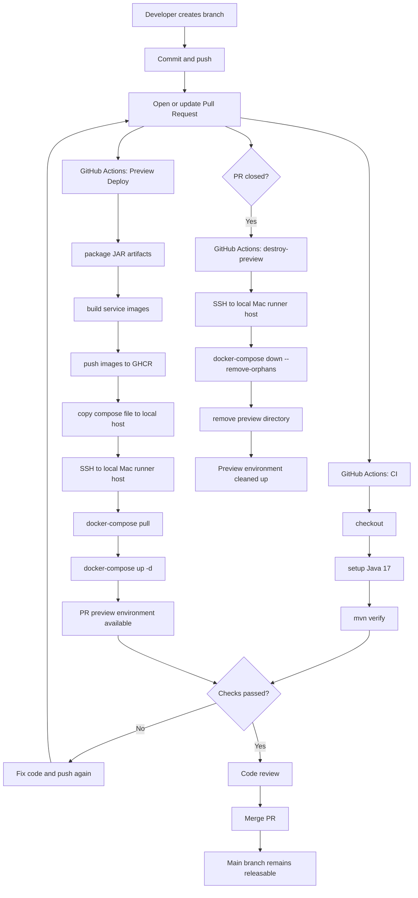

# GitHub R&D Flow Diagram

这张图解描述当前项目基于 GitHub 的最小研发闭环，重点是 `CI`、`Preview Deploy`、合并前验证，以及 `PR closed` 触发的自动销毁。

## Reading Guide

- `CI` 负责快速验证代码和构建是否通过。
- `Preview Deploy` 负责验证这次 PR 能否以接近真实部署的方式运行起来。
- `Code Review` 发生在 `CI + Preview` 都给出足够信号之后。
- `PR closed` 不论是否合并，都会触发预览环境销毁，避免本机残留容器和目录。

## Current Mapping

- CI workflow: [.github/workflows/ci.yml](/Users/mac/pspace/github/enterprise-cloud-lab/.github/workflows/ci.yml)
- Preview workflow: [.github/workflows/preview.yml](/Users/mac/pspace/github/enterprise-cloud-lab/.github/workflows/preview.yml)
- Runner notes: [docs/engineering/github-runner.md](/Users/mac/pspace/github/enterprise-cloud-lab/docs/engineering/github-runner.md)
